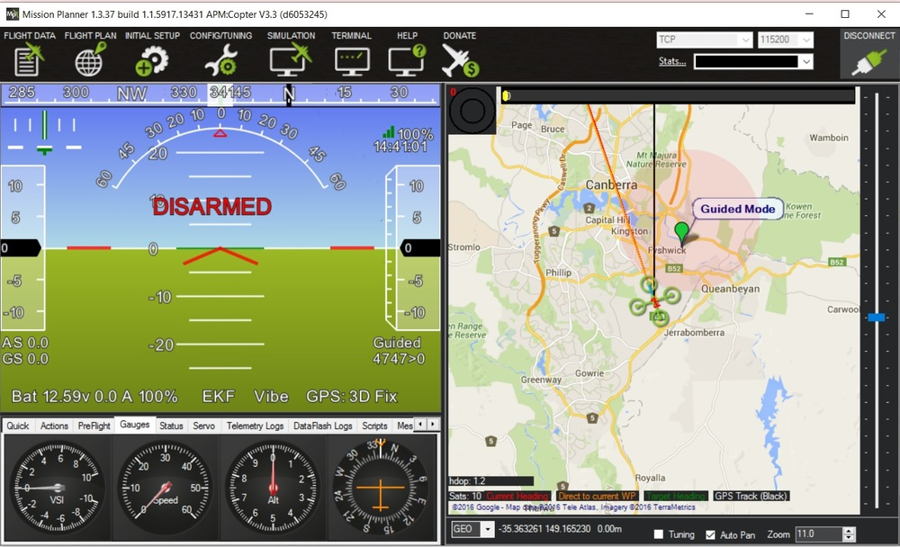
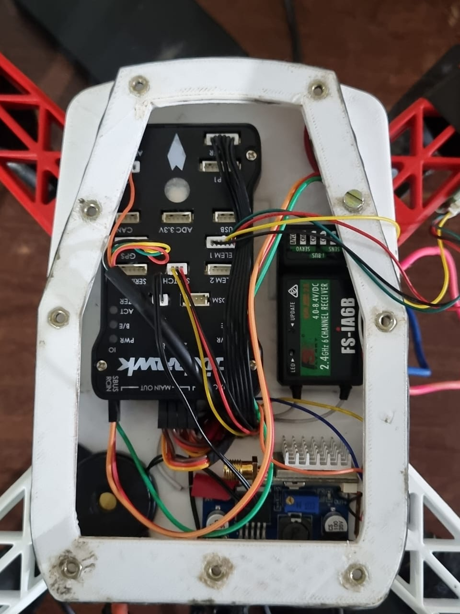
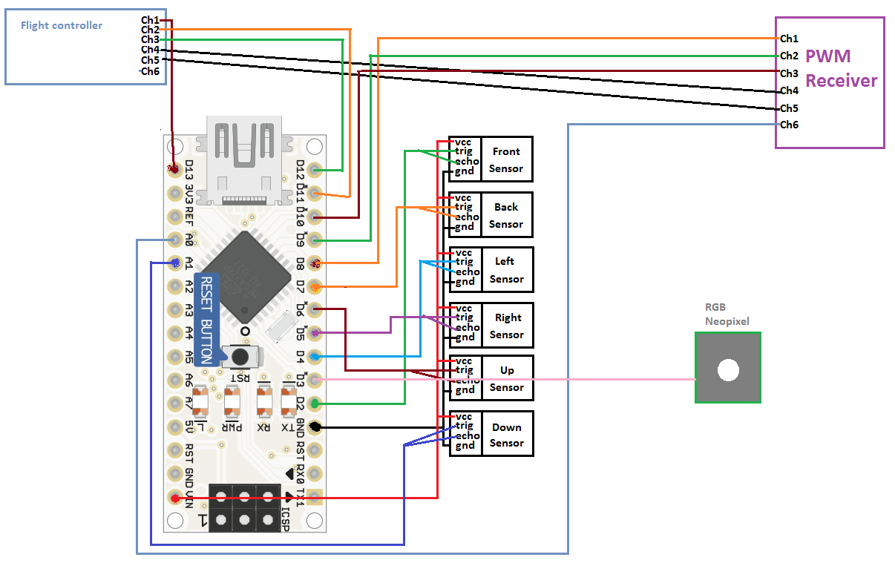
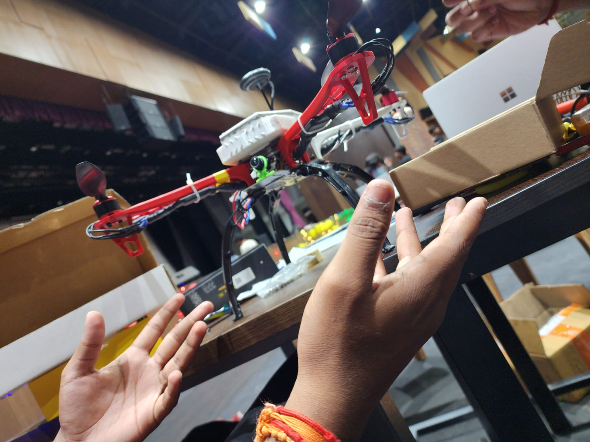

# Underwater Autonomous Drone System

An advanced autonomous drone system designed for both underwater and aerial operations. This project integrates flight control, robotics middleware, and real-time monitoring to enable precise navigation, payload deployment, and mission execution in complex environments.


## Overview

This repository presents a hybrid autonomous drone platform that combines Pixhawk-based flight control with ROS (Robot Operating System) to support intelligent decision-making and modular system integration.

The system is capable of operating in underwater and aerial environments, enabling applications such as inspection, surveillance, research, and targeted payload delivery.


## Key Features

* Autonomous navigation for underwater and aerial environments
* Integration with Pixhawk flight controller for stable control
* ROS-based architecture for modularity and scalability
* Precise payload dropping mechanism
* Real-time monitoring via FPV camera
* Ground control integration using QGroundControl
* GPS-based positioning (for aerial operations)
* Telemetry communication for live data feedback


## System Architecture

The system is composed of the following major components:

### Flight Control

* Pixhawk flight controller manages stabilization, control loops, and sensor fusion

### Middleware

* ROS enables communication between sensors, control logic, and mission planning modules

### Ground Control

* QGroundControl provides mission planning, parameter tuning, and live telemetry visualization

### Vision System

* FPV camera enables real-time video streaming for monitoring and navigation

### Navigation

* GPS module (for aerial mode) supports waypoint-based navigation

### Payload System

* Mechanism for controlled payload release with high positional accuracy




## Technology Stack

* PX4 / ArduPilot (Pixhawk firmware)
* ROS (Robot Operating System)
* MAVLink protocol
* QGroundControl
* Python / C++




## Use Cases

* Environmental monitoring and research
* Underwater inspection (pipelines, hulls, structures)
* Search and rescue assistance
* Defense and surveillance applications
* Precision payload delivery


## Getting Started

### Prerequisites

* Pixhawk-compatible flight controller
* ROS environment (ROS Noetic or later recommended)
* QGroundControl installed
* MAVLink-compatible telemetry modules

### Installation

```bash id="2l8kdf"
git clone https://github.com/your-username/underwater-autonomous-drone.git
cd underwater-autonomous-drone
```

### Setup

1. Install and configure ROS
2. Connect Pixhawk and verify firmware (PX4/ArduPilot)
3. Launch QGroundControl for parameter setup
4. Establish MAVLink communication between ROS and Pixhawk
5. Calibrate sensors (IMU, compass, GPS if applicable)





## Future Enhancements

* Advanced underwater localization (acoustic / vision-based)
* AI-based object detection and tracking
* Improved autonomous mission planning
* Enhanced communication for underwater environments
* Integration with SLAM for GPS-denied navigation


## Contribution

Contributions are welcome. Please fork the repository and submit pull requests for improvements, bug fixes, or new features.


## License

This project is intended for research and educational purposes.


